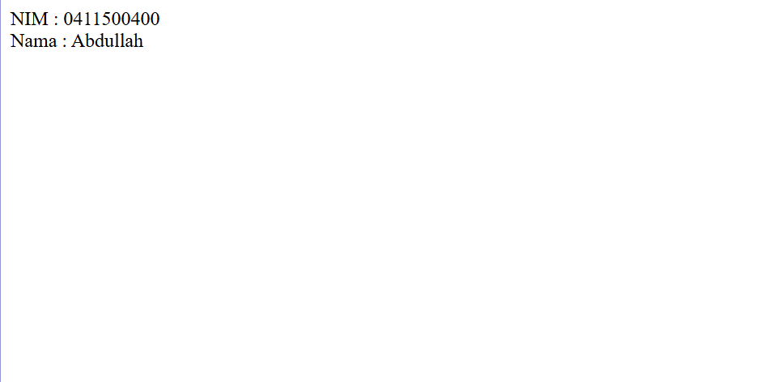
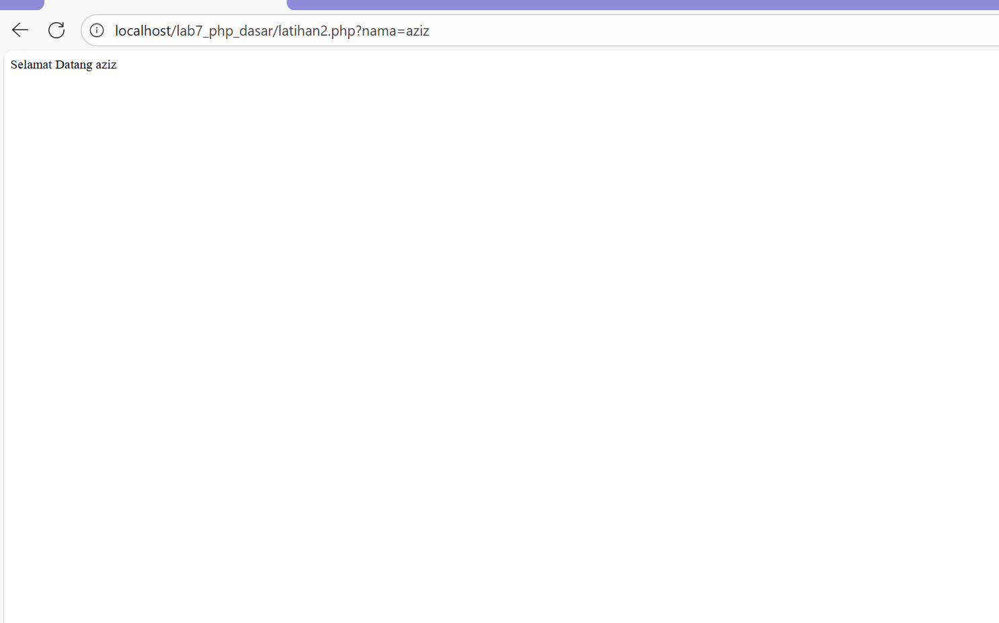
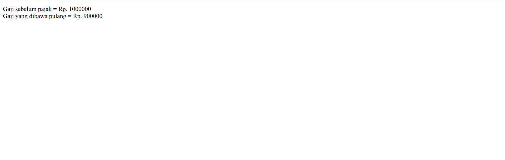
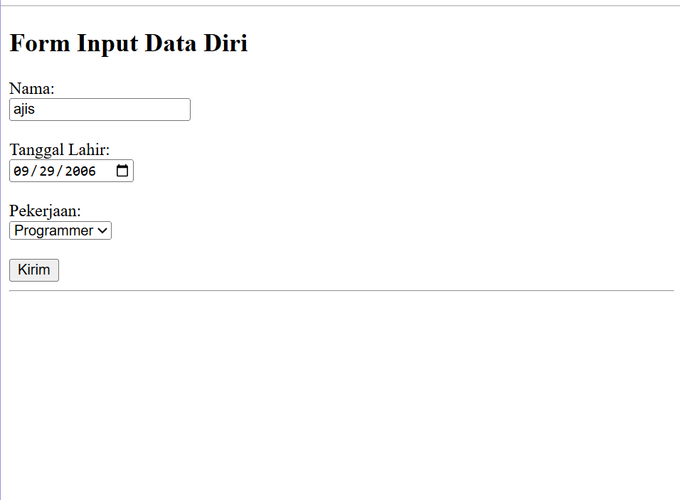
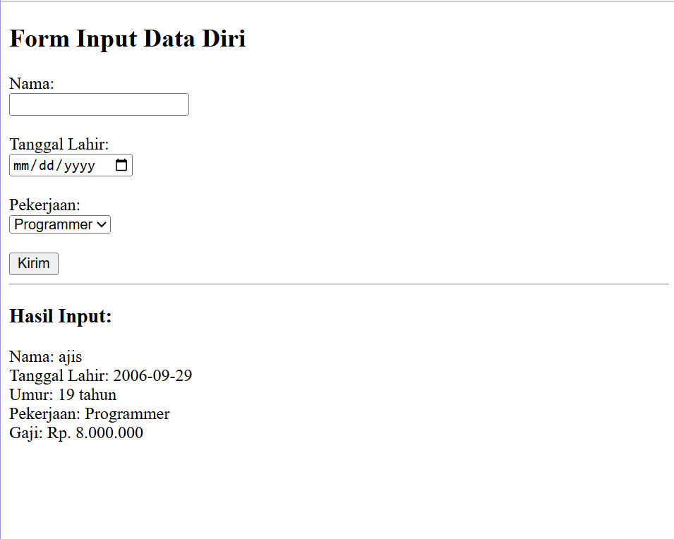

# 🌐 Praktikum 7 – PHP Dasar

### 👨‍🎓 Universitas Pelita Bangsa 
 
**Nama:** Muhammad Aziz Tri Ramadhan  

**NIM:** 312410380  

**Kelas:** TI.24.A3  

**Dosen Pengampu:** Agung Nugroho, S.Kom., M.Kom  

**Mata Kuliah:** Pemrograman Web  

---

## 📘 Tujuan Praktikum
1. Memahami konsep dasar *Server Side Scripting* menggunakan PHP.  
2. Memahami dasar pemrograman PHP.  
3. Memahami variabel dan tipe data pada PHP.  
4. Memahami struktur kondisi dan perulangan pada PHP.  
5. Mampu membuat program PHP sederhana berbasis form input.

---

## ⚙️ Persiapan Lingkungan
1. Install **XAMPP** untuk menjalankan Apache dan PHP.  
2. Simpan semua file ke dalam folder:
```

C:\xampp\htdocs\lab7_php_dasar\

```
3. Jalankan **Apache** di XAMPP Control Panel.  
4. Akses melalui browser:
```

[http://localhost/lab7_php_dasar/](http://localhost/lab7_php_dasar/)

````

```
## 💻 Langkah-langkah Praktikum

### 1. PHP Dasar – `php_dasar.php`
Menampilkan teks sederhana menggunakan PHP.
```php
<?php
echo "Hello World";
?>
```
#### 📸 Menampilkan tulisan “Hello World”.


```
```
### 2. Variabel – `variable.php`

Menggunakan variabel untuk menampilkan data.

```php
<?php
$nim  = "0411500400";
$nama = "Abdullah";

echo "NIM : " . $nim . "<br>";
echo "Nama : $nama";
?>
```

#### 📸 Menampilkan NIM dan Nama.


---
```
```
### 3. Predefine Variable – `latihan2.php`

Menangkap data dari URL menggunakan `$_GET`.

```php
<?php
echo 'Selamat Datang ' . $_GET['nama'];
?>
```

🔗 *Akses melalui:*
`http://localhost/lab7_php_dasar/latihan2.php?nama=Agung`

#### 📸 Capture



---

### 4. Form Input – `form_input.php`

Mengirim data ke server menggunakan method **POST**.

```php
<form method="post">
    <label>Nama:</label>
    <input type="text" name="nama">
    <input type="submit" value="Kirim">
</form>
```

#### 📸 Menampilkan hasil input nama.


---

### 5. Operator – `operator.php`

Melakukan perhitungan aritmatika dasar.

```php
$gaji  = 1000000;
$pajak = 0.1;
$thp   = $gaji - ($gaji * $pajak);
```

#### 📸 Menampilkan gaji sebelum dan sesudah pajak.



---

### 6. Kondisi IF – `kondisi_if.php`

Menentukan hari menggunakan struktur if-elseif.

```php
$nama_hari = date("l");
if ($nama_hari == "Sunday") echo "Minggu";
elseif ($nama_hari == "Monday") echo "Senin";
else echo "Selasa";
```
#### 📸 Capture


---

### 7. Kondisi Switch – `kondisi_switch.php`

Alternatif kondisi menggunakan *switch-case*.

```php
switch ($nama_hari) {
    case "Sunday": echo "Minggu"; break;
    case "Monday": echo "Senin"; break;
    case "Tuesday": echo "Selasa"; break;
    default: echo "Sabtu";
}
```
#### 📸 Capture


---

### 8. Perulangan For – `perulangan_for.php`

Melakukan perulangan naik dan turun.

```php
for ($i=1; $i<=10; $i++) echo "Perulangan ke: $i<br>";
```
#### 📸 Capture


---

### 9. Perulangan While & Do-While

Menampilkan perulangan dengan kondisi sebelum dan sesudah blok.

```php
while ($i<=10) { echo "Perulangan ke: $i<br>"; $i++; }
```
#### 📸 Capture


---

### 10. Tugas – `tugas.php`

Program PHP dengan input **nama, tanggal lahir, dan pekerjaan**.
Hasilnya menampilkan **umur dan gaji** berdasarkan pekerjaan.

```php
$pekerjaan = $_POST['pekerjaan'];
switch ($pekerjaan) {
    case "Programmer": $gaji = 8000000; break;
    case "Desainer": $gaji = 7000000; break;
    case "Manager": $gaji = 10000000; break;
    case "Freelancer": $gaji = 5000000; break;
}
```

#### 📸 Menampilkan nama, umur, pekerjaan, dan gaji sesuai input.




---

## 📂 Struktur Folder

```
lab7_php_dasar/
│
├── php_dasar.php
├── variable.php
├── latihan2.php
├── form_input.php
├── operator.php
├── kondisi_if.php
├── kondisi_switch.php
├── perulangan_for.php
├── perulangan_while.php
├── perulangan_dowhile.php
└── tugas.php
```

📚 **Universitas Pelita Bangsa – Fakultas Teknik**
Bekasi, 2025

